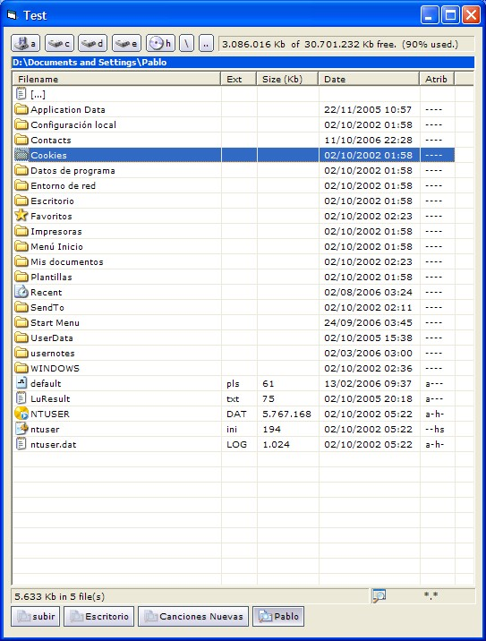



## Total Commander "like" Explorer

### Description

First of all , thanks for downloading this application, i made this explorer app with the idea of getting at least the basic functionality of Total commander, for example in sorting, etc, hope you like it, it works fine, more faster than other browser downloaded here, just try it.

Please Vote !, thanks again.
 
### More Info
 

             |
---                |---
**Submitted On**   |2007-04-29 07:02:10
**By**             |[pablo de donatis](https://github.com/Planet-Source-Code/PSCIndex/blob/master/ByAuthor/pablo-de-donatis.md)
**Level**          |Advanced
**User Rating**    |4.8 (19 globes from 4 users)
**Compatibility**  |VB 4\.0 \(32\-bit\), VB 5\.0, VB 6\.0
**Category**       |[Files/ File Controls/ Input/ Output](https://github.com/Planet-Source-Code/PSCIndex/blob/master/ByCategory/files-file-controls-input-output__1-3.md)
**World**          |[Visual Basic](https://github.com/Planet-Source-Code/PSCIndex/blob/master/ByWorld/visual-basic.md)
**Archive File**   |[Total\_Comm206476592007\.zip](https://github.com/Planet-Source-Code/pablo-de-donatis-total-commander-like-explorer__1-68546/archive/master.zip)

### API Declarations

Inside

